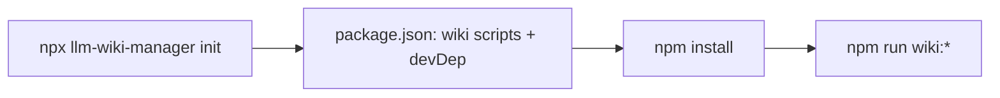

## Introduction

Thanks for contributing to llm-wiki-manager!

Open PRs against **`develop`** (the default branch). <!-- Releases are cut from **`main`**. --> Fill in the sections that apply and delete the rest, including the Introduction section.

## Summary

_One or two sentences: what does this change do, and why?_

_For non-trivial flows or architecture, consider a Mermaid diagram (see **Diagrams** below)._

## Changes

_Bullet the notable changes. Call out anything that affects the published surface: CLI commands/flags (`bin/cli.ts`), scaffold templates (`templates/`), or the `"files"` allowlist in `package.json`._

## Diagrams (optional)

For flows, architecture, or branch history, add a [Mermaid](https://mermaid.js.org/) diagram in the PR body. GitHub renders fenced ` ```mermaid ` blocks inline — no image uploads needed.

Good fits: CLI/init pipelines, upgrade steps, git branch strategy, before/after behavior.



Delete this section if a diagram does not add clarity.

## How to verify

_Exact commands a reviewer can run. For example:_

```bash
npm run build && node dist/bin/cli.js --help
npm test
npm run test:e2e
```

## Checklist

- [ ] `npm run lint` passes
- [ ] `npm run format:check` passes
- [ ] `npm test` passes
- [ ] `npm run test:e2e` passes
- [ ] `npm run build` succeeds
- [ ] If the dogfooded `wiki/` changed: `npm run wiki:build` produces no diff and `npm run wiki:lint` passes
- [ ] Docs updated (README/AGENTS) if behavior or the published surface changed
- [ ] No secrets or credentials committed

## Notes

_Optional: follow-ups, known limitations, or anything reviewers should be aware of._
