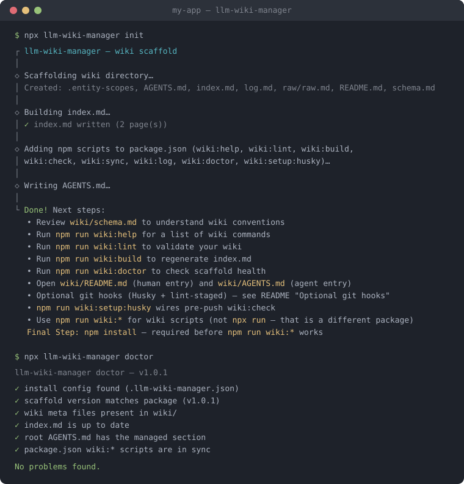

# llm-wiki-manager

[](https://github.com/lggarrison/llm-wiki-manager/actions/workflows/ci.yml)
[](https://www.npmjs.com/package/llm-wiki-manager)
[](LICENSE)
[](https://nodejs.org)

<p align="center">
  
</p>

## A Structured Repo Context for AI Coding Tools

- Better retrieval (an agent's context search finds the right doc because frontmatter/links are consistent and un-broken)
- A single reliable entry point (an index file that gives an agent a map of the repo it wouldn't otherwise infer)
- Enforced structure reducing noise (lint catching drift means an agent isn't reading stale or contradictory docs)

## What this is, in one paragraph

The wiki implements Karpathy's LLM-Wiki pattern: a persistent, compounding knowledge base that an LLM agent owns and maintains, sitting between the team and the raw sources. It is plain markdown, doubles as an Obsidian vault, and is wired into the repo's tooling (npm scripts, a pre-commit hook, and tool-specific discovery shims) so it stays current as the code changes. Code in your app's source code remains the source of truth for behavior; wiki pages describe and cite code (via `code_refs:` frontmatter) but never duplicate it.

Scaffold and manage a persistent, LLM-maintained wiki for your project. Rather than relying on retrieval-augmented generation (RAG), this tool sets up a structured knowledge base that an LLM agent incrementally builds, cross-references, and synthesizes over time.

---

## What gets created

Running `init` scaffolds the following into your project:

```
wiki/
├── AGENTS.md          # Agent entry point (full instructions)
├── schema.md          # LLM conventions: frontmatter spec, operations, link rules
├── README.md          # Human entry point
├── index.md           # Auto-generated content catalog
├── log.md             # Append-only operation log
├── .entity-scopes     # Required entity overview slugs (one per line)
├── entities/          # Flat — scope entry points and entity-family pages
├── concepts/          # Cross-cutting synthesized knowledge
├── sources/           # Summaries of ingested source documents
├── archive/           # Deprecated pages (optional)
└── raw/
    ├── raw.md         # Hub for immutable ingested artifacts
    └── articles/, prs/, tickets/, design-notes/, transcripts/, assets/

AGENTS.md              # Repo-root pointer to wiki/AGENTS.md (created or amended)
.llm-wiki-manager.json # Install metadata (version, wiki dir, focus dirs)

package.json           # wiki:* npm scripts added (when present; invoke llm-wiki-manager)
```

---

## Installation

Install from [npm](https://www.npmjs.com/package/llm-wiki-manager) or [GitHub](https://github.com/lggarrison/llm-wiki-manager).

### From npm (recommended)

Run without adding a dependency first:

```bash
npx llm-wiki-manager init
npm install
```

`init` adds `llm-wiki-manager` to `devDependencies` and `wiki:*` npm scripts when `package.json` exists. Run `npm install` afterward so `npm run wiki:*` commands resolve the local CLI binary.

Or install the package before init:

```bash
npm install --save-dev llm-wiki-manager
npx llm-wiki-manager init
```

Pin a specific version:

```bash
npx llm-wiki-manager@1.0.2 init
```

Unpinned `npx llm-wiki-manager` uses your project's local `node_modules` install when one exists. After init, run `npm install` so the installed version matches what init recorded in `.llm-wiki-manager.json`.

### From GitHub

Useful when you want to install directly from the repository (for example, before a version hits npm, or to test a branch):

```bash
npx github:lggarrison/llm-wiki-manager init
```

Or add it as a dev dependency:

```bash
npm install --save-dev github:lggarrison/llm-wiki-manager
npx llm-wiki-manager init
```

Pin a release tag:

```bash
npx github:lggarrison/llm-wiki-manager#v1.0.0 init
```

If your machine is set up with a GitHub SSH key, you can use the SSH form instead:

```bash
npm install --save-dev git+ssh://git@github.com/lggarrison/llm-wiki-manager.git
```

### From a local clone

```bash
git clone https://github.com/lggarrison/llm-wiki-manager.git
cd llm-wiki-manager
npm install
npm run build
npm link            # makes `llm-wiki-manager` available globally

# then, from your target project:
llm-wiki-manager init
```

---

## Initializing the wiki

From the root of your project, run:

```bash
npx llm-wiki-manager init
```

You will be prompted for:

| Prompt            | Default                    | Description                                     |
| ----------------- | -------------------------- | ----------------------------------------------- |
| Project name      | _(current directory name)_ | Used in AGENTS.md headings and schema.md        |
| Wiki directory    | `wiki`                     | Where the wiki files are created                |
| Focus directories | _(blank = whole project)_  | Directories the wiki documents, e.g. `src, api` |

To skip prompts (CI, scripts, or non-interactive shells), pass `--project-name` and optionally the other flags:

```bash
npx llm-wiki-manager init \
  --project-name my-app \
  --wiki-dir wiki \
  --focus-dirs src,api
```

`--project-name` is required to skip prompts. `--wiki-dir` and `--focus-dirs` default to the values in the table above.

After `init` completes:

1. Run `npm install` if you used `npx llm-wiki-manager init` without installing first — `init` records `llm-wiki-manager` in `devDependencies`, but the binary is not available until dependencies are installed
2. Open `wiki/schema.md` to review the conventions your agent will follow
3. Point your LLM agent at `AGENTS.md` (repo root) — it directs to `wiki/AGENTS.md` for full instructions
4. Run `npm run wiki:doctor` to confirm the scaffold is healthy — `init` generates a fresh `index.md`, so `wiki:check` should pass immediately
5. Run `npm run wiki:lint` to validate page structure

If your project has no `package.json`, invoke the CLI directly (see [Managing the wiki](#managing-the-wiki)).

### Troubleshooting

| Error                                                               | Cause                                                | Fix                                                                      |
| ------------------------------------------------------------------- | ---------------------------------------------------- | ------------------------------------------------------------------------ |
| `Cannot find module '.../wiki:lint'`                                | Ran `npx run wiki:lint` (different npm package)      | Use `npm run wiki:lint` or `npx llm-wiki-manager lint`                   |
| `Missing script: "wiki:doctor"`                                     | Older package version before `wiki:doctor` was added | Run `npx llm-wiki-manager upgrade`, or use `npx llm-wiki-manager doctor` |
| `llm-wiki-manager: command not found` when running `npm run wiki:*` | Dependencies not installed                           | Run `npm install`, then confirm with `npm run wiki:doctor`               |

**Command patterns:**

| Use case                    | Command                                                       |
| --------------------------- | ------------------------------------------------------------- |
| One-time scaffold / upgrade | `npx llm-wiki-manager init` or `npx llm-wiki-manager upgrade` |
| Day-to-day wiki maintenance | `npm run wiki:*` (e.g. `npm run wiki:lint`)                   |
| Before `npm install`        | `npx llm-wiki-manager lint` (direct CLI)                      |

Do not use `npx run wiki:*` — that invokes a different npm package named `run`.

Re-running `init` on an existing project is safe: it only creates missing scaffold files and does not overwrite your wiki content or `log.md`. To refresh wiki templates (`schema.md`, `wiki/AGENTS.md`, root `AGENTS.md`) and sync npm scripts after updating the package, use **upgrade**:

```bash
npx llm-wiki-manager upgrade
npx llm-wiki-manager upgrade --dry-run   # preview changes
```

Install metadata is stored in `.llm-wiki-manager.json` at the project root.

---

## Updating the wiki

### Ingesting a new source document

Place the raw document (article, spec, transcript, etc.) into `wiki/raw/`, then ask your agent to ingest it. The agent will:

1. Read the raw document and discuss key takeaways
2. Create a summary page in `wiki/sources/`
3. Create or update concept pages in `wiki/concepts/`
4. Add cross-references between related pages

After the agent finishes, run the maintenance scripts:

```bash
npm run wiki:sync                     # sync related: links to page bodies
npm run wiki:build                    # regenerate index.md
npm run wiki:log -- add ingest "Title of source"
```

### Querying the wiki

Ask your agent a question. It will read `wiki/index.md` to locate relevant pages, then synthesize an answer with citations. If the query reveals a gap, the agent should create a stub page (`status: wip`) to track it.

```bash
npm run wiki:log -- add query "Summary of the question"
```

### Editing pages manually

- Update `last_updated` in the frontmatter whenever you change a page
- Run `npm run wiki:build` after adding or removing pages
- Run `npm run wiki:lint` to catch any broken links or missing fields

---

## Managing the wiki

All commands are subcommands of `llm-wiki-manager`. Run `npm run wiki:help` (or `npx llm-wiki-manager help`) anytime for a quick reference with typical workflows.

Global options (work with any command):

```bash
llm-wiki-manager --help      # list all subcommands
llm-wiki-manager --version   # print installed package version
DEBUG=1 llm-wiki-manager …   # print a full stack trace on errors (useful for bug reports)
```

When `init` finds a `package.json`, it adds the `wiki:*` npm scripts below. Project lifecycle commands (`init`, `upgrade`) are invoked directly — they are not npm scripts.

| Command       | npm script         | Purpose                                                                    |
| ------------- | ------------------ | -------------------------------------------------------------------------- |
| `init`        | —                  | Scaffold a new wiki (see [Initializing](#initializing-the-wiki))           |
| `upgrade`     | —                  | Refresh templates and migrate pages after a package update                 |
| `help`        | `wiki:help`        | List wiki npm scripts with usage, when-to-run hints, and typical workflows |
| `lint`        | `wiki:lint`        | Validate frontmatter, links, and structure                                 |
| `build`       | `wiki:build`       | Regenerate `index.md`                                                      |
| `check`       | `wiki:check`       | Verify `index.md` is up to date (read-only)                                |
| `sync`        | `wiki:sync`        | Sync `related:` frontmatter to body links                                  |
| `log`         | `wiki:log`         | Append operation entries to `log.md`                                       |
| `doctor`      | `wiki:doctor`      | Read-only scaffold health check                                            |
| `setup-husky` | `wiki:setup:husky` | Wire pre-push `wiki:check`; print lint-staged guide                        |

Wiki subcommands (`lint`, `build`, `check`, `sync`, `log`) accept `--wiki-dir path/to/wiki` when the wiki is not at the default location. `--repo-root` is also available for advanced layouts.

### Help — wiki command reference

```bash
npm run wiki:help
# or: npx llm-wiki-manager help
```

Prints every `wiki:*` npm script with a one-line summary, when to run it, and an example command. Also lists typical workflows (ingest, edit pages, git hooks, package upgrades). This is the day-to-day reference for wiki maintenance.

For the full CLI surface — including `init` and `upgrade` — use top-level help:

```bash
llm-wiki-manager --help
```

### Lint — validate structure

```bash
npm run wiki:lint
```

Checks for:

- Missing or invalid frontmatter fields
- Block-style `- item` YAML lists in frontmatter (use inline arrays instead)
- `related:` paths that don't resolve to existing files
- Broken markdown links in page bodies
- Wikilinks (`[[...]]`) that should be markdown links
- `related:` entries with no corresponding body link
- Orphaned pages (no other page links to them)
- Stale wiki references in AGENTS.md

Options:

```bash
llm-wiki-manager lint --warn-only          # report errors without exiting 1
llm-wiki-manager lint --wiki-dir path/to/wiki
```

### Build index — regenerate index.md

```bash
npm run wiki:build
```

Walks all wiki pages, reads their frontmatter, and writes a fresh `index.md` grouped by page type (overview/hub → concepts → sources). Run this any time pages are added, removed, or renamed.

Options:

```bash
npm run wiki:build -- --wiki-dir path/to/wiki
llm-wiki-manager build --wiki-dir path/to/wiki   # without npm scripts
```

### Check index — verify index.md is current

```bash
npm run wiki:check
```

Compares the existing `index.md` to what `wiki:build` would produce. Exits with code 1 if stale. Useful in pre-push hooks and CI because it does not modify files.

Options:

```bash
npm run wiki:check -- --wiki-dir path/to/wiki
```

### Log — record operations

```bash
npm run wiki:log -- add <op> "<title>"
```

Operations: `ingest`, `query`, `lint`, `maintenance`

Examples:

```bash
npm run wiki:log -- add ingest "RFC 9110 HTTP Semantics"
npm run wiki:log -- add query "How does auth token refresh work?"
npm run wiki:log -- add lint "weekly health check"
npm run wiki:log -- add maintenance "archived three stale pages"

# Backdate an entry
npm run wiki:log -- add ingest "Old doc" --date=2025-01-15
```

Options:

```bash
npm run wiki:log -- add <op> "<title>" --wiki-dir path/to/wiki
llm-wiki-manager log add <op> "<title>" --wiki-dir path/to/wiki   # without npm scripts
```

### Doctor — check scaffold health

```bash
npx llm-wiki-manager doctor
```

Read-only health check for an installed scaffold. Verifies the install config exists, the scaffold version matches the installed package (suggesting `upgrade` when behind), the wiki meta files are present, the root `AGENTS.md` still has its managed section, the `wiki:*` npm scripts are in sync, and `index.md` is up to date. Exits 1 if any problem is found — useful after `init`, before an `upgrade`, or when something feels off.

### Upgrade — refresh templates after a package update

```bash
npx llm-wiki-manager upgrade
```

Refreshes wiki meta templates (`schema.md`, `wiki/AGENTS.md`, `wiki/README.md`), the root `AGENTS.md` managed section, and `wiki:*` npm scripts. Runs page migration (legacy frontmatter values), sync, build, and lint as post-upgrade steps. User-owned wiki pages and `log.md` are preserved.

Options:

```bash
npx llm-wiki-manager upgrade --dry-run    # preview changes without writing files
npx llm-wiki-manager upgrade --skip-pages # refresh templates only; skip migrate/sync/build/lint on pages
```

Re-running `init` only creates missing scaffold files; use `upgrade` to pick up template changes from a newer package version. Run `doctor` first to see what needs attention.

### Setup Husky — wire pre-push wiki:check

```bash
npm run wiki:setup:husky
```

Activates Husky (if installed), creates `.husky/` when needed, and adds `npm run wiki:check` to `.husky/pre-push`. Re-running is safe — it skips hooks that are already configured. Also prints a lint-staged pre-commit guide. See [Optional git hooks](#optional-git-hooks) for the full Husky + lint-staged setup.

### Sync see-also — fix missing body links

```bash
npm run wiki:sync
```

For every `related:` entry in a page's frontmatter that lacks a corresponding markdown link in the body, appends the missing link under a `## See also` section. This keeps the wiki graph consistent.

Options:

```bash
npm run wiki:sync -- --dry            # preview changes without writing
npm run wiki:sync -- --wiki-dir path/to/wiki
llm-wiki-manager sync --wiki-dir path/to/wiki   # without npm scripts
```

---

## Wiki page conventions

Every wiki page must have YAML frontmatter:

```yaml
---
type: concept # overview | entity | comparison | deep-dive | concept | source | hub
title: 'Page Title'
last_updated: 2025-06-30T00:00:00Z
tags: [auth, api]
related: [] # relative paths from wiki root — inline arrays only, not "- item" lists
status: wip # active | wip | deprecated
---
```

- Place pages in the directory matching their type: `concepts/`, `sources/`, `entities/` (overview/entity/comparison/deep-dive), or hub pages at `README.md`, `index.md`, and `raw/raw.md`
- Use markdown links `[Title](path.md)` — never wikilinks `[[...]]`
- Write frontmatter arrays inline (`related: [a.md, b.md]`); block-style `- item` lists are rejected by lint
- Every path in `related:` must also appear as a body link (run `npm run wiki:sync` to auto-add)
- See `wiki/schema.md` for the full specification

---

## Optional git hooks

`init` does not install git hooks in your project — it only adds npm scripts when `package.json` exists. You can wire up hooks yourself if you want automated wiki checks.

### Recommended setup (Husky + lint-staged)

| Hook       | Command              | Why                                                               |
| ---------- | -------------------- | ----------------------------------------------------------------- |
| pre-push   | `npm run wiki:check` | Verify `index.md` is current (read-only; does not modify files)   |
| pre-commit | `npx lint-staged`    | Run wiki build/lint only when staged files include `wiki/**/*.md` |

**1. Install dependencies**

If you used `npx llm-wiki-manager init`, `llm-wiki-manager` is already in `devDependencies` — install it along with hook tooling:

```bash
npm install -D husky lint-staged prettier
```

If the package is not in `devDependencies` yet, include it in the install command:

```bash
npm install -D llm-wiki-manager husky lint-staged prettier
```

**2. Pre-push — initialize Husky and wire `wiki:check`**

```bash
npm run wiki:setup:husky
```

This activates Husky, creates `.husky/` if needed, and adds `npm run wiki:check` to `.husky/pre-push` (or appends it when the hook already exists). Re-running is safe — it skips hooks that are already configured.

If you prefer to do it by hand, create `.husky/pre-push` with:

```sh
npm run wiki:check
```

**3. Pre-commit — add lint-staged config to `package.json`**

```json
"lint-staged": {
  "wiki/**/*.md": [
    "npm run wiki:build",
    "npm run wiki:lint",
    "prettier --write"
  ]
}
```

Adjust the glob if your wiki directory is not `wiki/`. lint-staged re-stages any files modified by these tasks (including regenerated `wiki/index.md`).

**4. Pre-commit — create `.husky/pre-commit`**

```sh
npx lint-staged
```

### Minimal setup (no lint-staged)

Run `npm run wiki:setup:husky` for pre-push only. Before committing wiki changes, run `npm run wiki:build` and `npm run wiki:lint` manually instead of using lint-staged.

---

## Requirements

- Node.js **20.12 or later** to run the CLI (CI tests Node 20 and 24 on Linux and Windows)
- For development on this repo, Node 24 — use [`.nvmrc`](.nvmrc) (`nvm use` / `fnm use`)

For Node toolchain policy, `@types/node` alignment, and Dependabot/CI guardrails, see [wiki/concepts/node-version-and-types.md](wiki/concepts/node-version-and-types.md).

---

## Development

```bash
git clone https://github.com/lggarrison/llm-wiki-manager.git
cd llm-wiki-manager
nvm use              # or: fnm use  (Node 24 — see .nvmrc)
npm install          # also sets up Husky git hooks and builds dist/
npm run build        # compile TypeScript to dist/
npm test             # run the vitest suite
npm run test:e2e     # end-to-end CLI workflow tests (builds dist/ first)
npm run release:check # full gate: lint, format, tests, e2e, wiki:lint, wiki:check
npm run lint         # check with ESLint
npm run lint:fix     # auto-fix ESLint issues
npm run format       # format with Prettier
npm run format:check # verify formatting without writing
```

The compiled CLI entry point is `dist/bin/cli.js` (built from `bin/cli.ts`). The `prepare` script sets up Husky and runs the build automatically on install and before publishing, so `dist/` is always present in the published package.

### Internal wiki

This repo dogfoods its own wiki workflow. Internal knowledge about `src/` and `templates/` lives in:

- [`wiki/index.md`](wiki/index.md) — auto-generated page catalog
- [`wiki/AGENTS.md`](wiki/AGENTS.md) — agent instructions (`AGENTS.md` at repo root points here)

Run `npm run wiki:help` for wiki commands. CI and `release:check` run `wiki:lint` and `wiki:check`. Wiki operations are implemented as `llm-wiki-manager` subcommands in `src/wiki/` — no scripts are copied into consumer projects.

Note: this repo's own `wiki:*` npm scripts call `node dist/bin/cli.js` directly, because npm does not link a package's own `bin` into its own `node_modules/.bin`. Consumer projects get the `llm-wiki-manager <command>` form. Run `npm run build` before the `wiki:*` scripts after changing `src/`, and don't run `upgrade` against this repo (it would rewrite the scripts to the consumer form).

### Code quality & git hooks

This repo uses [ESLint](https://eslint.org), [Prettier](https://prettier.io), and [Husky](https://typicode.github.io/husky/) with [lint-staged](https://github.com/lint-staged/lint-staged):

- **pre-commit** — `npx lint-staged` (wiki pages run `wiki:build`, `wiki:lint`, and Prettier via `package.json`)
- **pre-push** — `npm run release:check` (lint, format, tests, build, and wiki checks)

Husky is only installed in the local development repo; it is skipped automatically in CI, production installs, and when the package is consumed as a dependency.

Issues and pull requests are welcome at [github.com/lggarrison/llm-wiki-manager](https://github.com/lggarrison/llm-wiki-manager/issues).

### Releases

Every version tag is published to [npm](https://www.npmjs.com/package/llm-wiki-manager) and as a [GitHub Release](https://github.com/lggarrison/llm-wiki-manager/releases) at the same time. Pin a specific version:

```bash
npx llm-wiki-manager@1.0.0 init
# or from GitHub:
npx github:lggarrison/llm-wiki-manager#v1.0.0 init
```

Release history is in [CHANGELOG.md](CHANGELOG.md). Maintainers: see [RELEASING.md](RELEASING.md) for the full cut-a-release runbook.

---

## License

MIT — see [LICENSE](LICENSE).

## Contributing

See [CONTRIBUTING.md](CONTRIBUTING.md) for setup, the branch model, and how to open a pull request. Release history is in [CHANGELOG.md](CHANGELOG.md); maintainers see [RELEASING.md](RELEASING.md). To report a security issue privately, see [SECURITY.md](SECURITY.md).
